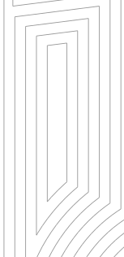
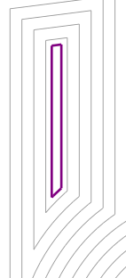

This code turns an SVG file into a gcode toolpath where it basically area
clears inside the shapes.
Althernatively you can provide a binary STL file and create toolpaths from
that.

NOTE: The SVG parser is extremely limited and only really works on SVG files
exported from Carbide Create. Over time I'll work on expanding the SVG
import capability

This is very early stage software and really only meant to experiment with
toolpath generation techniques etc etc... so meant for prototyping &
research not production

Carbide 3D forum discussion at https://community.carbide3d.com/t/cutting-forces-with-carbide-create-and-how-i-got-derailed-a-bit/18097/

# Example files

git clone https://github.com/fenrus75/FenrusCNCtoolsData.git

has several example files I use for regression testing

# Requirements

The tool is developed on Linux. The main external requirement is CGAL
(libcgal-dev or equivalent). A Windows port is now available as well in the
"releases" section.

Also currently Toolpath assumes you have a "bitsetter" or equivalent device
since it creates one integrated gcode file for all endmills used. If you 
do not have a bitsetter device or similar, you should pass the "-x" command
line option to generate separate gcode files for each tool.

# Features

## Less-Fuzz pocketing

Sometimes pocketing toolpaths leave "fuzz" in the middle, or even small
ridges. The root cause for this is that, as the toolpaths get created from
the outside shape to the closest inner "ring", the final ring is too small
to fit in another ring at full stepover, but is bigger than a single
stepover size.

Toolpath solves this by trying to do a "half stepover" in strategic places,
making sure that no area of the pocket is cut at more than the stepover
distance.

## Finishing pass

Many CAM tools allow you to add a finishing pass, sometimes automatic
sometimes partially manual.  Toolpath has a simple, central, option to add a
finshing pass to just about all its operations.  It will then keep a small
(0.1mm by default) stock to leave for a final pass to clean up, minimizing
deflection and other forces that might result in visible imperfections.

## Multi-tool pocketing for roughing

For fine details you need to use a small diameter endmill, but if you also
need to clear big areas, the time to do the cut is going to be excesively
long. Using a roughing pass with a large diameter endmill is the normal
solution, and Toolpath supports this natively, the user just specifies
the series of endmills (1, 2 or even more) she or he wants to use, and the
various toolpaths will be generated automatically.

## Outside-in pocketing

## Spiraling cutout

Doing a cutout of the work piece out of its larger material is a very common
operation. Some CAM tools do this by cutting a series of rings at increasing
depths, while plunging the bit a little deeper each time between rings.
It turns out that this order of operations causes fluctuating forces (and
thus deflection from the endmill). Especially if the plunging happens in a
rounded corner, these can cause visible artifats on the final work piece.

Toolpath uses a spiraling model where the endmill starts above the workpiece
and gently spirals down to the bottom at a constant vertical decline,
keeping forces constant for the cutout operation.

## V carving with depth limit + 2nd tool for pocketing

When doing a V-carve of a complicated design, one of the key issues that
comes up on the Carbidge 3D forum is the desire to be able to specify a
maximum depth for the V carve (rather than plunging through the work into
the wasteboar). Toolpath supports this feature; you just need to specify
a second tool to be used for clearing out the flat inner pockets and the
depth will be honered. 

## Automatic V carve Inlays

Making inlays out of two different pieces of wood can give very beautiful
results... but it often needs two different steps. Toolpath can generate
the two sets of gcode files from a single instantiation and input file.

## Slowing down for corners

When cutting pockets, the corners of the design are the most stressful
operation of the whole cut, since this is where the cutter engagement is the
highest. Toolpath will slow down cuts just before hitting corners, thus
reducing the maximum force on the system and reducing the probability
of the work piece coming lose from the work holding.

## Direct Drive toolpath (CSV)

Sometimes you just want a simple "run this tool from here to there", while
honoring max depth of cut and doing multiple passes. Toolpath supports this
using a special CSV file format.
The CSV file supports a few primitives

X,Y,Z				simple straight line to the specified coordinates
	
Xm1, Ym1, Zm1, X, Y, Z    	quadratic bezier curve via intermediate point
				Xm1,Ym1,Zm1 to X,Y,Z
Xm1, Ym1, Zm1, Xm2, Ym2, Z2, X, Y, Z    	cubic bezier curve via two intermediate
						points			

X, Y, Z, R			cut a sphere a sphere with center X,Y,Z and radius R
			

## STL files

If all you want to do is turn that STL file you downloaded into a nice wood
design... Toolpath can also do that... see the examples below

key command line options

-Y    show STL from the side instead of from the top
-X    show STL from the front instead of from the top
-Z <pct>  lower the STL <pct> percent and "cut of the back" 

make sure to set a --depth or --cutout; the STL will be scaled to this
depth keeping its original aspect ratio and the tool will print the
dimensions of the work

# Basic working assumptions

The toolpath tool assumes that the SVG is exported from Carbide Create, and
that the topology has no overlaps or other "weird" things.
Toolpath then will (from outside in) assume that you want to pocket clear
the area of a shape it finds, but shapes are allowed to have holes that
won't be pocketed. Holes can have shapes in them etc... basically an "even
odd" model, where from outside in, every other line you cross will toggle
"pocket" or "not pocket".

Toolpath currently only supports 1 pocket depth (V carving, inlay and cutout paths
behave specially) that is specified on the command line.
Multiple tools can be specified on the command line, and the tool assumes
that the order of tools is "Any V carve bits. Then pocket bits from large to
small". Various options are available in metric and imperial units;
internally toolpath uses metric units, conversion to/from imperial or other
units happens at the boundaries of the program.

# Use examples

Create a V carve pocket with a maximum depth of 0.125" using the 60 degree V
bit and using the 1/8th inch #102 bit for area clearing:

> toolpath -d 0.125in -t 302 -t 102 foo.svg

Pocket the shape, using bit #201 in "outside in" direction for roughing, and
bit #102 for final detail, also apply a finishing pass

> toolpath -d 0.125in -t -201 -t 102 --finshing-pass  foo.svg

Create a V carve inlay with a 60 degree V bit, and use bits 201 and 102 for
area clearance. Use the outer shape for cutout (using bit 201)

> toolpath -d 0.125in -t 302 -t 201 -t 102 --inlay --cutout 0.25in  foo.sh

Create the gcode for carving out an STL design with a cutout
 
> toolpath --cutout 0.75in -t 201 -t 101 --finish-pass heart.stl

Create the gcode for carving out an STL design without a cutout, and
splitting the output in one file per tool
 
> toolpath --depth 0.75in -t 201 -t 101 --stock-to-leave 0.2mm  heart.stl

# Todo list (what I know is wrong or what I want to add)

## Things to fix

* SVG parser is extremely hard coded/limited; using a library can improve this but will add another dependency

## Future things to experiment with

* Proper rest machining

